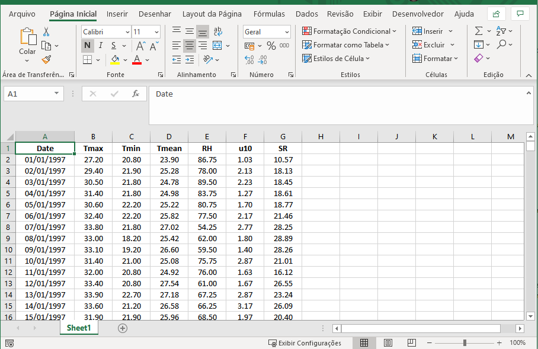
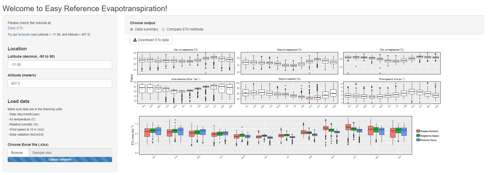
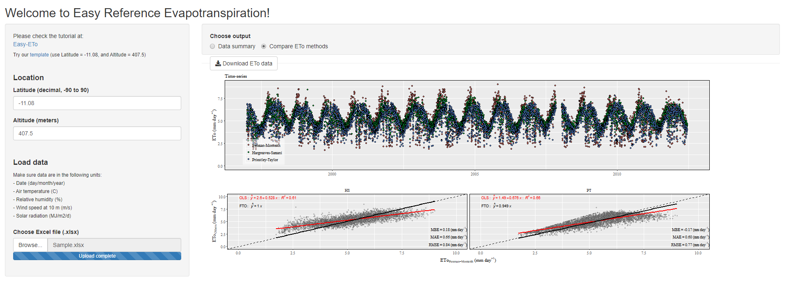

<div class="fluid-row" id="header">
    
    <h1 class="title toc-ignore">Easy Reference Evapotranspiration</h1>
    <h4 class="author"><em>Daniel Althoff</em></h4>
</div>

# About

Easy Reference Evapotranspiration (Easy-ETo) is a ShinyApp used to compute reference evapotranspiration (ETo).<br> 

* ETo is computed according to three methods:
    * PM = Penman-Monteith (Allen et al. 1998);
    * HS = Hargreaves-Samani (Hargreaves and Samani, 1982); and,
    * PT = Priestley-Taylor (Priestley and Taylor, 1972).

PM-ETo estimates are used as reference to compare with HS-ETo and PT-ETo estimates.

This tutorial is on how to run the Easy-ETo app online or with R.

# Release History

* 1.0.0
    * Upload climatic data to Easy-ETo and download reference evapotranspiration data
    * Two options of data visualization

# How to use

<h4>1. Open the <b>Easy-ETo</b> app</h4>
<h6>With ShinyApp</h6>
<p>Access the <a href="https://daniel-althoff.shinyapps.io/easy-eto/" target="blank">Easy-ETo</a> app directly in shinyapps.io.</p>

<h6>With R</h6>
<p>Install the required packages and run the <b>Easy-ETo</b> app</p>

```{r setup}
if (!require("pacman")) install.packages("pacman")
pacman::p_load(shiny, readxl, writexl, dplyr, tidyr,  ggplot2, ggpmisc, lubridate, hydroGOF, update=F)

runGitHub("Easy-ETo", "danielalthoff")
```


    
<h4>2. Provide the weather station <b>latitude</b> and <b>altitude</b></h4>
<p> Latitude should be in decimal (-90 to 90) and altitude in meters (> 0).<br>
    For this tutorial, we used the sample data available as <a href="https://github.com/danielalthoff/Easy-ETo/raw/master/Sample.xlsx" target="blank">template</a>. This dataset was retrieved from the Brazilian National Institute of Meteorology (<a href='http://www.inmet.gov.br/portal/' target='blank'>INMET</a>) database (<a href="http://www.inmet.gov.br/portal/index.php?r=estacoes/estacoesConvencionais" target='blank'>BA - BARRA</a>) and went through minimal pre-processing.<br><br>
    The station's corresponding latitude and altitude are -11.08° and 407.5 meters, respectively</p> 

<h4>3. Prepare your Excel (.xlsx) file</h4>
<p> Download the <a href="https://github.com/danielalthoff/Easy-ETo/raw/master/Sample.xlsx" target="blank">template</a> and use it as referente<br>
    Your excel file should look like this:</p>


     
<p>Make sure your variables are in the following units:</p>
<ul>
  <li>Tmax, Tmean, Tmin = Maximum, mean and minimum daily air temperatura (°C);</li>
  <li>Relative humidity (%);</li>
  <li>Wind speed at 10 m above ground (m/s);</li>
  <li>Solar radiation (MJ/m²/d);</li>
  <li>Date (dd/mm/yyyy).</li>
</ul>


<h4>4. Load the Excel file to the <b>Easy-ETo</b> app</h4>
<p>Wait for your file to upload and choose one of the two visualization options:</p>
<ul>
    <li><b>Data summary</b>: provides boxplots for each meteorological variable and for the different reference evapotranspiration methods</li>
</ul>


     
<ul>
    <li><b>Compare ETo methods</b>: provides the reference evapotranspiration methods <em>Time-series</em> and <em>scatterplots</em> with the following metrics:
        <li>MBE = mean bias error (mm/day) - average error from PT and HS methods minus PM;</li>
        <li>MAE = mean absolute error (mm/day);</li>
        <li>RMSE = root mean square error (mm/day);</li>
        <li>OLS = ordinary least squares regression;</li>
        <li>FTO = fitted to the origin regression.</li>
    </li>
</ul>



<h4>5. Download the Excel file with ETo data</h4>
<p>The <b>download button</b> appears a few seconds after the Excel file upload completes.
    
<h4>Enjoy!</h4>
:smile:

# References

* Allen RG, Pereira LS, Raes D, Smith M (1998) Crop evapotranspiration - Guidelines for computing crop water requirements - FAO Irrigation and drainage paper 56, 9th edn. Food and Agriculture Organization of the United Nations, Rome.

* Hargreaves GH, Samani ZA (1982) Estimating potential evapotranspiration. Journal of the Irrigation and Drainage Division 108:225–230

* Priestley CHB, Taylor RJ (1972) On the assessment of surface heat flux and evaporation using large-scale parameters. Monthly weather review 100:81–92

